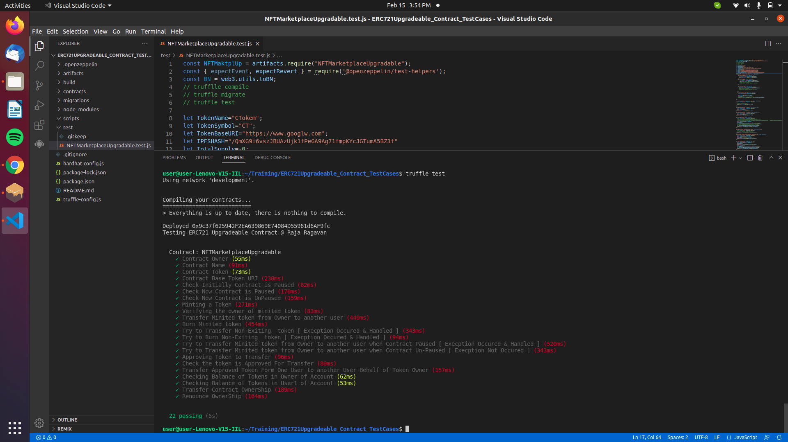

# ERC 721 Upgradeable Contract Testing Unit Testing

- This Project is a Sample Template of ERC721 Upgradeable Contract and Created testcases for getting familiar in testing ERC721 Upgradeable Contracts.
- This Testing is done using `truffle test`
- For each and every unit testing an new instance of the contract is created uing `this` keyword.

## Getting started 📖

📁 Create a new folder in VScode.  
- Open Your termial in Vscode and following commands. or press  `Ctrl+Shift+` `

🏃 Run: -- To Initalize Truffle template and truffle config files.⚙️
```
truffle init
```
🏃 Run: -- To Initalize Node.  ( Here `-y` means we are saying `yes` to all steps in node creation )
```
npm init -y
```


## Node Dependencies 🎒
Try ` npm i ` in cmd to install all nessecary dependencies mentioned in `package.json` file

or use 

``` 
npm install @openzeppelin/cli 
```
``` 
npm install @openzeppelin/contracts-upgradeable
```
``` 
npm install @openzeppelin/truffle-upgrades
```
``` 
npm install @openzeppelin/upgrades
```
``` 
npm install @openzeppelin/test-environment
```
``` 
npm install @openzeppelin/test-helpers 
```
``` 
npm install chai
```
``` 
npm install mocha 
```
``` 
npm install hardhat
```
``` 
npm install assert
```
## Compiling the Contracts 🛠️

🏃 Run: -- To Compile contracts to create artifacts of contracts

```
truffle compile
```
## To Migrate Contracts 🦅

Use the Following Command to run testing.

```
 truffle migrate
```

## To Run Testing ⛏️

Use the Following Command to run testing.

```
 truffle test
```

## Screeshot of Testing 👀


